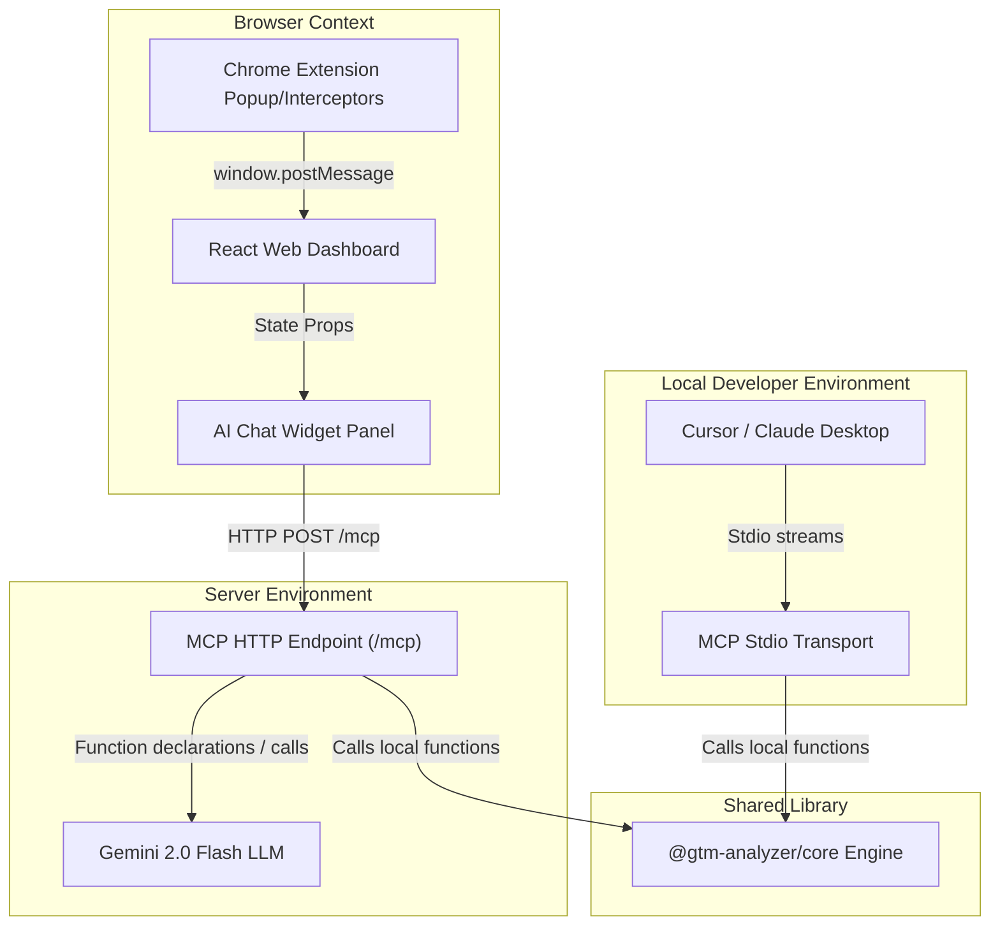
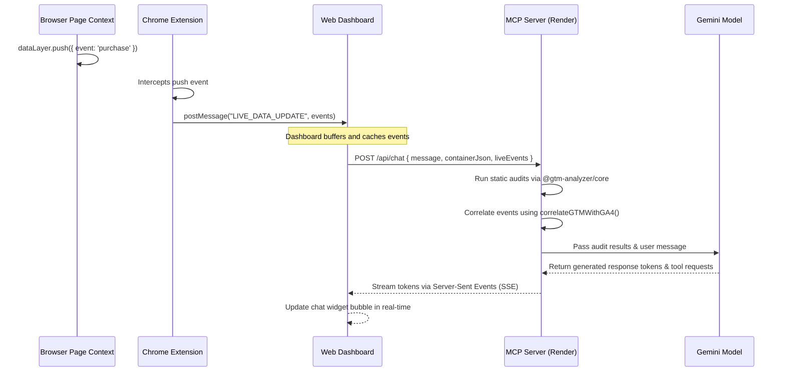

# GTM Container Analyzer — Architecture Documentation

This document describes the high-level system architecture, data routing flows, and component responsibilities of the GTM Container Analyzer analytics auditing system.

---

## 1. System Topology

GTM Container Analyzer consists of four primary components designed to collaborate securely:
1. **Chrome Extension Debugger**: Monitors client-side user pages, intercepts GTM events (`dataLayer.push`), monitors tag network requests, and bridges events via a DOM channel.
2. **React Web Dashboard**: Provides a client-side interface for parsing GTM JSON export files and visualizes container execution flows. Implements the streaming chat assistant UI.
3. **Core Analysis Library (`@gtm-analyzer/core`)**: Zero-dependency library containing GTM schemas, auditing algorithms (naming, GA4 specifications, consent rules), and security sanitizers.
4. **MCP Server**: Operates as a stateless Node.js endpoint exposing tools via stdio (for local IDE integrations like Cursor) and Streamable HTTP (for the web dashboard).



---

## 2. Component Directory Layout

```
gtm-container-analyzer/
├── extension/                  # Chrome Extension source
├── packages/
│   └── core/                   # Shared TypeScript analysis engine
│       ├── src/
│       │   ├── parser/         # GTM JSON container parser
│       │   ├── audit/          # Naming conventions, GA4 event rules, consent mode
│       │   └── security/       # Input sanitizer, credential redactor
│       └── dist/               # Compiled ES module library
│
├── mcp-server/                 # Express-based dual mcp server
│   ├── src/
│   │   ├── index-http.ts       # Streamable HTTP (MCP 2025-03-26 spec)
│   │   ├── index-stdio.ts      # Local Stdio Transport (Cursor, Claude)
│   │   ├── tools/              # Tools registration schema definitions
│   │   ├── ai/                 # Multi-model orchestrator and prompt templates
│   │   └── security/           # Path guards, origin checkers, and rate limiters
│   └── dist/                   # Compiled server distribution
```

---

## 3. Data Flow Sequences

### 3.1 Live Event Correlation Flow

When checking tag fire triggers against live browser session telemetry, data executes along this route:



---

## 4. Security Architecture

### 4.1 DNS Rebinding & Cross-Site Requests
Per the **MCP 2025-03-26 Specification Warning #1**, the hosted server validates the HTTP `Origin` header of every incoming request. Only allowed domains (e.g. `gtmcontaineranalyzer.com` or local dev hosts) can establish Streamable HTTP connections, mitigating DNS rebinding vulnerabilities.

### 4.2 Credential Redaction & Prompt Safety
User containers often contain embedded third-party API keys (like Facebook Pixel IDs or AWS access keys). The `@gtm-analyzer/core` security sanitizer parses raw JSON configurations and automatically redacts strings matching sensitive credential signatures using regex patterns *before* passing payload context to external generative models.
