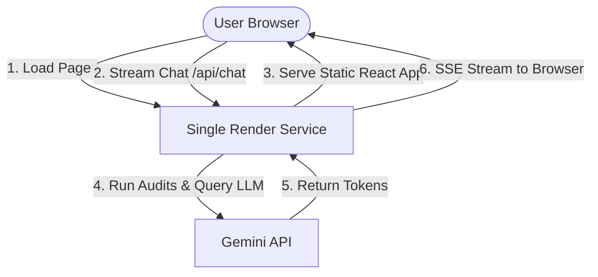

# GTM Container Analyzer — Deployment Guide

This guide details the steps to package and deploy both the **GTM Container Analyzer Frontend (React)** and **Backend (MCP Express Server)** as a **single web service** on **Render.com** for staging and showcase purposes.

Serving everything from a single hosted instance provides several advantages:
1. **Single Staging URL**: Users can access the app at one clean domain (e.g. `https://demo.gtmcontaineranalyzer.com` or a generic Render domain).
2. **Zero CORS Obstacles**: Same-domain hosting eliminates browser cross-origin checks completely.
3. **Safe & Private**: The staging site will not be indexed by Google or other search engines.
4. **No Risk to Production**: Your main website (`https://gtmcontaineranalyzer.com` on Vercel) remains 100% untouched.

---

## 1. Unified Deployment Architecture



---

## 2. Staging & No-Indexing Strategy

To ensure that your showcase environment is **never indexed by search engines**, the codebase contains the following configurations:

### 2.1 Backend Security (`X-Robots-Tag`)
The Express server has global middleware configured in [index-http.ts](file:///Users/prathameshanabhavane/Documents/Pratham/gtm-container-analyzer/mcp-server/src/index-http.ts) that injects the `X-Robots-Tag: noindex, nofollow` header into all responses. This instructs Googlebot and all other crawlers to completely ignore the server.

### 2.2 Frontend Staging
For the unified server deployment on Render, the `X-Robots-Tag` header will apply to all frontend assets and index HTML pages as well, guaranteeing zero search engine indexing.

---

## 3. Step-by-Step Deployment Instructions

### Step 3.1: Deploy Unified Backend Server on Render

We have provided a preconfigured [render.yaml](file:///Users/prathameshanabhavane/Documents/Pratham/gtm-container-analyzer/render.yaml) blueprint specification in the root of the repository to automate the setup process.

#### Option A: Blueprint Deploy (Recommended - One-Click)
1. Sign up or log into [Render.com](https://render.com/).
2. In the dashboard, click **New +** (top right) and select **Blueprint**.
3. Link your GitHub account and select your `gtm-container-analyzer` repository.
4. Give your Blueprint Group a name (e.g., `gtm-container-analyzer-group`).
5. Render will automatically read the `render.yaml` file. You will be prompted to enter:
   * **`GEMINI_API_KEY`**: *(Your Google AI Studio Gemini API Key)*
6. Click **Apply**. Render will automatically run the build steps (building frontend and backend) and launch the service.

#### Option B: Manual Web Service Deploy (Alternative)
1. Sign up or log into [Render.com](https://render.com/).
2. Click **New +** and select **Web Service**.
3. Connect your GitHub repository.
4. Set the following configurations:
   * **Name**: `gtm-container-analyzer-mcp`
   * **Runtime**: `Node`
   * **Build Command**: `npm ci && npm run build && cd packages/core && npm ci && npm run build && cd ../../mcp-server && npm ci && npm run build`
   * **Start Command**: `node mcp-server/dist/index-http.js`
5. Add the following **Environment Variables** under the service settings:
   * `GEMINI_API_KEY`: *(Your Gemini API Key)*
   * `NODE_ENV`: `production`
   * `PORT`: `3001`
   * `ALLOWED_ORIGINS`: `https://demo.gtmcontaineranalyzer.com,https://YOUR-APP-NAME.onrender.com,http://localhost:5173` *(Replace the middle value with your specific Render app URL once generated)*
6. Click **Deploy Web Service**.

#### Crucial Step (Keep-Alive for Free Tier)
Because Render's free tier services spin down after 15 minutes of inactivity, setup a free uptime monitor (like [cron-job.org](https://cron-job.org/)) pointing to `https://YOUR-APP-NAME.onrender.com/health` every 10 minutes to prevent the container from falling asleep.

---

### Step 3.2: Register the Staging URL in Google Cloud Console

This ensures Google OAuth consent succeeds on your hosted staging domain.

1. Open the [Google Cloud Console Credentials Screen](https://console.cloud.google.com/apis/credentials).
2. Edit your active **Web Client ID**.
3. Under **Authorized JavaScript origins**, click **+ Add URI** and enter:
   * `https://demo.gtmcontaineranalyzer.com` (or your generic Render URL like `https://YOUR-APP-NAME.onrender.com`).
4. Click **Save**.
5. Wait 5 minutes for Google to sync the changes.

---


## 4. Local Testing Before Deployment

You can build the frontend and run the production Express server locally:
```bash
# 1. Build packages
cd packages/core && npm install && npm run build

# 2. Build frontend
cd ../.. && npm install && npm run build

# 3. Start local production HTTP server
cd mcp-server && npm install && PORT=3001 GEMINI_API_KEY=mock NODE_ENV=production node dist/index-http.js
```
1. Navigate to `http://localhost:3001` in the browser.
2. Confirm the React app loads and interacts with the API locally.
3. Check the HTTP response headers in browser DevTools to ensure `X-Robots-Tag: noindex, nofollow` is present.
