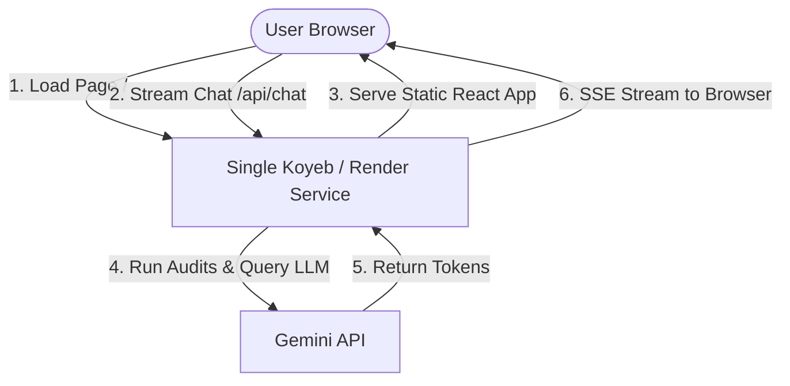

# GTM Container Analyzer — Deployment Guide

This guide details the steps to package and deploy both the **GTM Container Analyzer Frontend (React)** and **Backend (MCP Express Server)** as a **single web service** on **Koyeb** or **Render** for staging and showcase purposes.

Serving everything from a single hosted instance provides several advantages:
1. **Single Staging URL**: Users can access the app at one clean domain (e.g. `https://demo.gtmcontaineranalyzer.com` or a generic Koyeb/Render domain).
2. **Zero CORS Obstacles**: Same-domain hosting eliminates browser cross-origin checks completely.
3. **Safe & Private**: The staging site will not be indexed by Google or other search engines.
4. **No Risk to Production**: Your main website (`https://gtmcontaineranalyzer.com` on Vercel) remains 100% untouched.

---

## 1. Unified Deployment Architecture



---

## 2. Staging & No-Indexing Strategy

To ensure that your showcase environment is **never indexed by search engines**, the codebase contains the following configurations:

### 2.1 Backend Security (`X-Robots-Tag`)
The Express server has global middleware configured in [index-http.ts](file:///Users/prathameshanabhavane/Documents/Pratham/gtm-container-analyzer/mcp-server/src/index-http.ts) that injects the `X-Robots-Tag: noindex, nofollow` header into all responses. This instructs Googlebot and all other crawlers to completely ignore the server.

### 2.2 Frontend Staging
For the unified server deployment on Koyeb/Render, the `X-Robots-Tag` header will apply to all frontend assets and index HTML pages as well, guaranteeing zero search engine indexing.

---

## 3. Step-by-Step Deployment Instructions

### Step 3.1: Deploy Unified Backend Server

#### Option A: Koyeb (Recommended - Stays Active 24/7)
1. Sign up for a free account on [Koyeb](https://www.koyeb.com/).
2. Create a new App and choose **GitHub** as the deployment source.
3. Select your `gtm-container-analyzer` repository.
4. In the configuration:
   * **App Name**: `gtm-container-analyzer-demo`
   * **Builder**: Choose **Docker** (it will auto-detect the `/mcp-server/Dockerfile` at the root).
   * **Ports**: Change the exposed port to `3001` (matching the Dockerfile configuration).
   * **Environment Variables**: Add the following keys:
     * `GEMINI_API_KEY`: *(Your Google AI Studio Gemini API Key)*
     * `NODE_ENV`: `production`
     * `PORT`: `3001`
     * `ALLOWED_ORIGINS`: `https://demo.gtmcontaineranalyzer.com,https://gtm-container-analyzer-demo-xxxx.koyeb.app,http://localhost:5173` *(Replace the middle value with your specific Koyeb URL)*
5. Click **Deploy**. Koyeb will build the Docker container and provide a free generic URL (e.g. `https://gtm-container-analyzer-demo-xxxx.koyeb.app`).
6. *(Optional)* Add your custom subdomain `demo.gtmcontaineranalyzer.com` under Koyeb App settings and point your DNS CNAME to Koyeb.

#### Option B: Render.com (Alternative - Sleeps after inactivity)
1. Sign up or log into [Render](https://render.com/).
2. Create a new **Web Service** from your linked Git repository.
3. Select **Docker** as the environment.
4. Add environment variables:
   * `GEMINI_API_KEY`: *(Your Gemini Key)*
   * `NODE_ENV`: `production`
   * `PORT`: `3001`
   * `ALLOWED_ORIGINS`: `https://demo.gtmcontaineranalyzer.com,https://gtm-container-analyzer-api.onrender.com,http://localhost:5173`
5. Deploy and get the Render URL.
6. **Crucial Step (Keep-Alive)**: Setup a free uptime monitor (like [cron-job.org](https://cron-job.org/)) pointing to `https://YOUR-APP.onrender.com/health` every 10 minutes to prevent the container from falling asleep.

---

### Step 3.2: Register the Staging URL in Google Cloud Console

This ensures Google OAuth consent succeeds on the staging domain.

1. Open the [Google Cloud Console Credentials Screen](https://console.cloud.google.com/apis/credentials).
2. Edit your active **Web Client ID**.
3. Under **Authorized JavaScript origins**, click **+ Add URI** and enter:
   * `https://demo.gtmcontaineranalyzer.com` (or your generic Koyeb/Render URL like `https://gtm-container-analyzer-demo-xxxx.koyeb.app`).
4. Click **Save**.
5. Wait 5 minutes for Google to sync the changes.

---

## 4. Local Testing Before Deployment

You can build the frontend and run the production Express server locally:
```bash
# 1. Build packages
cd packages/core && npm install && npm run build

# 2. Build frontend
cd ../.. && npm install && npm run build

# 3. Start local production HTTP server
cd mcp-server && npm install && PORT=3001 GEMINI_API_KEY=mock NODE_ENV=production node dist/index-http.js
```
1. Navigate to `http://localhost:3001` in the browser.
2. Confirm the React app loads and interacts with the API locally.
3. Check the HTTP response headers in browser DevTools to ensure `X-Robots-Tag: noindex, nofollow` is present.
