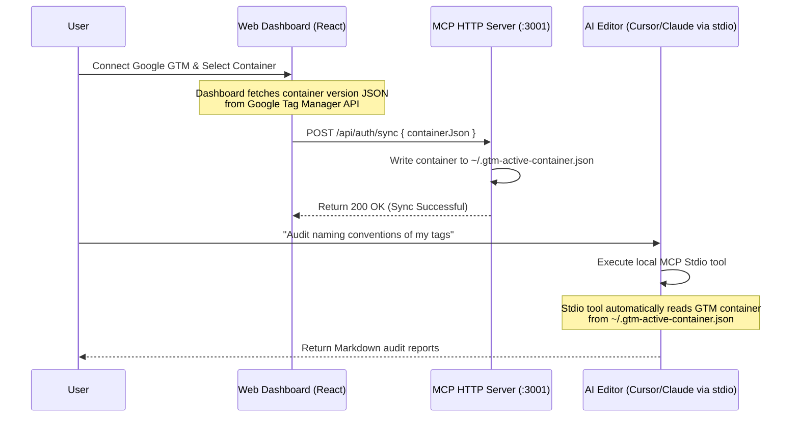

# GTM Live API & Local Google OAuth Flow

This document details the synchronized, database-free architecture that connects GTM Insight's Web Dashboard and local Model Context Protocol (MCP) clients (Cursor, Claude Desktop, VS Code) using a shared configuration file.

---

## 1. Simplified Dashboard-Sync Flow

Rather than implementing dynamic OAuth redirections and token exchange inside the CLI/MCP server, GTM Insight leverages the existing Google OAuth flow built into the visual web dashboard.



---

## 2. Shared Container Configuration File

The selected container's configuration is saved in the user's home directory at **`~/.gtm-active-container.json`**:

```json
{
  "containerId": "GTM-5GD9BP36",
  "name": "demostore.com",
  "syncedAt": "2026-07-19T01:05:00Z",
  "containerVersion": {
    "container": {
      "publicId": "GTM-5GD9BP36",
      "name": "demostore.com"
    },
    "tag": [ ... ],
    "trigger": [ ... ],
    "variable": [ ... ]
  }
}
```

* **No Database Requirement:** Uses the local filesystem to sync state between the visual dashboard browser tab and the local terminal/IDE subprocesses.
* **Always in Sync:** Selecting a different account or container in the visual dashboard instantly updates the local JSON file. Any subsequent prompt in Cursor is immediately run on the new GTM context.

---

## 3. Fallback Context Resolution

When an MCP auditing tool (e.g. `check_naming_conventions` or `validate_ga4_compliance`) runs, the backend determines the active container context using this priority:

1. **Explicit Parameter:** Check if `containerJson` is supplied directly in the tool arguments (used when the chat panel POSTs query payloads).
2. **Local Workspace File:** Check if a `filePath` is provided (e.g. `check_naming_conventions({ filePath: "GTM-xxxx.json" })` in the workspace).
3. **Dashboard Sync File:** If both are missing, load the container from **`~/.gtm-active-container.json`**.
4. **Failure State:** If none are found, instruct the user to select a container in the Web Dashboard or link it via file upload.

---

## 4. Security, OWASP Compliance & Data Safety

To align with **OWASP API Security Top 10** standards and ensure absolute data safety, the GTM Dashboard Sync flow enforces four secure guardrails:

### 4.1 Token Minimization & Isolation (OWASP - Sensitive Data Exposure)
* **The Principle:** The local IDE standard I/O subprocess (`index-stdio.js`) has **zero access** to the user's active Google account OAuth tokens.
* **Implementation:** The React Dashboard fetches GTM details from Google APIs browser-side and POSTs the parsed, non-credential container JSON to the local backend sync route. The tokens themselves are never saved to the local file `~/.gtm-active-container.json`, preventing key leakage or token theft from IDE extension environments.

### 4.2 Dynamic CORS Origin Validation (OWASP - CSRF / DNS Rebinding)
* **The Principle:** Prevent public external websites or third-party browser scripts from posting fake configs or exploiting the local HTTP backend.
* **Implementation:** The `POST /api/auth/sync` route validates incoming request headers and restricts access exclusively to trusted origins (`http://localhost:5173` or `https://gtmcontaineranalyzer.com`). Any cross-site requests or unvalidated domains are rejected with `403 Forbidden`.

### 4.3 Safe File System Permissions (OWASP - Improper File Permissions)
* **The Principle:** Secure local workspace files from unauthorized local system users.
* **Implementation:** The file `~/.gtm-active-container.json` is initialized with strict POSIX user-only access permissions (`0600` or `-rw-------`). Only the local system user running the GTM Insight dashboard and IDE processes can read/write GTM data.

### 4.4 Payload Validation & Limits (OWASP - Denial of Service / Injection)
* **The Principle:** Prevent large files from crashing the node environment, and block injection payloads.
* **Implementation:**
  * The `/api/auth/sync` endpoint enforces a Zod payload validation schema to ensure variables conform to GTM specifications.
  * Express sets a body limit constraint of 5MB, rejecting excessive payloads to mitigate Denial of Service (DoS) risks.
