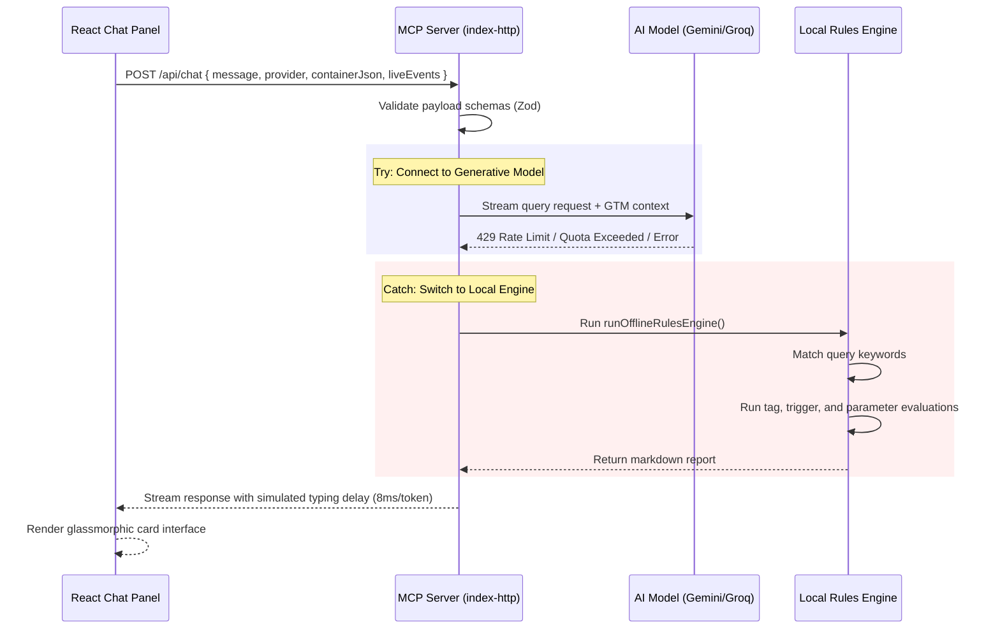

# GTM Container Analyzer — Offline Resilience & Premium Audits Flow

This document details the self-healing failover mechanism, the Local Offline Rules Engine logic, and the user-centric interactive suggestion prompts that power GTM Container Analyzer.

---

## 1. Request Flow & Try/Catch Failover

To guarantee high availability when generative AI keys (Gemini, OpenAI, Groq) hit rate limits (429 errors) or when local Ollama endpoints are unresponsive, GTM Container Analyzer employs a zero-crash self-healing transport flow.

---

## 2. Interactive Suggestions & Cards Layout

The frontend welcome panel displays a matrix of **8 Quick Audit cards**. Each card is designed to show a clear title and description explaining what it checks before the user clicks:

* **🔍 Audit Naming:** *"Verify naming pattern consistency across tags & variables."*
  * Sends prompt: `"Audit naming conventions of my container and show issues"`
* **📈 GA4 Compliance:** *"Check custom event names against Google GA4 restrictions."*
  * Sends prompt: `"Validate my GA4 events and parameters against Google rules"`
* **🛡️ Consent & Privacy:** *"Audit third-party pixels firing without consent settings."*
  * Sends prompt: `"Are my marketing tags firing before consent?"`
* **🛒 Ecommerce Health:** *"Validate GA4 purchase tags for transaction variables."*
  * Sends prompt: `"Why doesn't my GA4 ecommerce revenue match my store's sales?"`
* **🧹 Find Bloat & Cleanup:** *"Scan for duplicate Custom HTML tags and unused variables."*
  * Sends prompt: `"Find duplicate, unused, or orphaned tags/triggers/variables"`
* **⚡ Script Performance:** *"Identify render-blocking scripts that slow down page loads."*
  * Sends prompt: `"Which tags are slowing down page load?"`
* **🔗 Live Correlation:** *"Cross-reference live debugger logs with GTM tags."*
  * Sends prompt: `"Check my live events correlation to see if they match GTM configurations"`
* **🎓 Explain Setup:** *"Read a plain-English structural summary of this container."*
  * Sends prompt: `"Explain my container setup in plain English"`

---

## 3. Local Rules Engine Audits Matrix

When the local engine is triggered, it runs static evaluation patterns against GTM version JSON objects:

| Check | Keywords | Static Assessment Logic |
| :--- | :--- | :--- |
| **Naming Consistency** | `naming`, `convention` | Scans tags, triggers, and variables to verify standard vendors and action classification prefixes. |
| **GA4 Event Rules** | `ga4`, `compliance`, `validate` | Checks event names for alphanumeric characters and underscores, flagging any reserved system events. |
| **Consent & Privacy** | `consent`, `privacy` | Identifies third-party marketing tags (Meta, TikTok) firing on page views without dynamic Consent Mode settings. |
| **Ecommerce Variables** | `ecommerce`, `revenue`, `purchase` | Verifies GA4 `purchase` tags contain required variables (`transaction_id`, `value`, `currency`, `items`). |
| **Bloat & Cleanup** | `bloat`, `cleanup`, `unused` | Detects identical Custom HTML content injections and registers unreferenced container variables. |
| **CWV Performance** | `performance`, `slow`, `speed` | Identifies early render-blocking scripts and recommends deferring triggers to DOM Ready or Window Loaded. |
| **Live Correlation** | `correlation`, `live` | Correlates extension-captured action logs with triggers to find discrepancy errors. |
| **Plain-English Explainer** | `explain`, `setup` | Groups tags by type (GA4 config vs GA4 event vs custom scripts) to generate a text summary walkthrough. |
